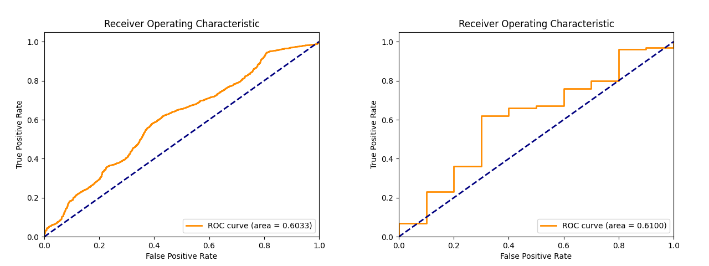
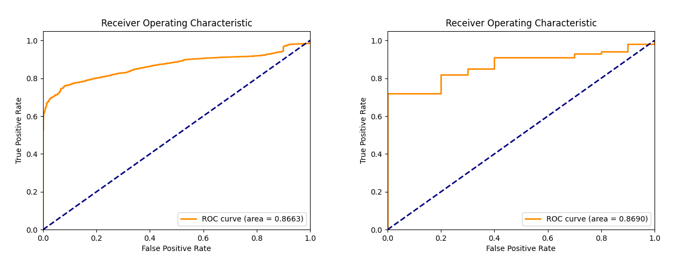
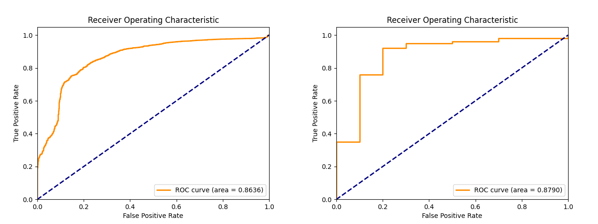

# Background

With the rapid advancement of image generation technology, the quality and realism of deepfake videos continue to improve, creating severe challenges for society in distinguishing between authentic and fake images[@clarity2025deepfake] [@detectingai2025rise]. Particularly in scenarios where the forgery techniques encountered during testing differ from those in training, existing recognition models often experience significant drops in recognition rates, indicating substantial room for improvement in their generalization capabilities[@liu2025comprehensive].

Recent research indicates that vision-language models (VLMs) similar to CLIP, even without fine-tuning, already possess a certain degree of semantic understanding capability and can be re-programmed through minimal parameter adjustments, thereby endowing models with cross-type deepfake recognition abilities[@themoonlight2025unlocking].

This study focuses on exploring the application potential of vision-language foundation models in deepfake detection tasks under cross-type settings. We limit training data sources to include only real videos and FaceSwap forgery data, while using another unseen forgery type (NeuralTextures) as test data to evaluate the model's recognition performance on unknown types. We further combine low-parameter strategies such as LoRA or Visual Re-programming Mask for adjustment to achieve effective learning and recognition.

## Motivation for Different Adaptation Strategies

The choice of different parameter-efficient fine-tuning strategies is motivated by their distinct advantages and computational considerations:

- **CLIP with LoRA**: LoRA decomposes weight updates into low-rank matrices, reducing trainable parameters while maintaining performance. This enables efficient adaptation of CLIP's vision encoder without modifying the entire architecture.

- **CLIP with Visual Re-programming Mask**: This approach adapts the model through input-level transformations rather than parameter modifications, leveraging pre-trained models' existing representational capacity while maintaining interpretability.

- **Qwen2.5-VL with QLoRA**: Despite higher computational costs, this approach provides superior multimodal understanding and textual explanations for decisions, crucial for interpretability in forensic and legal applications. QLoRA enables efficient fine-tuning of large models with limited resources.

This study not only validates the potential of foundation models in the field of image authenticity verification but also provides effective solutions for the "unknown forgery methods" problem in practical applications.

# Methodology

## Dataset

The dataset used in this study is FaceForensics++ (FF++), which is divided according to authenticity and forgery methods. We use 80% of Real_youtube for training, validation, and testing phases (with 10% each for validation and testing), and 90% of FaceSwap for the training phase with 10% for validation. We completely reserve NeuralTextures forgery data for the testing phase to evaluate the model's generalization capability.

| Data Source    | Training | Validation | Testing | Testing2 | Frame Count         |
| -------------- | :------: | :--------: | :-----: | :------: | ------------------- |
| Real_youtube   |   80%    |    10%     |  10%\*  |  10%\*   | 8080/1010/1010/1010 |
| FaceSwap       |   90%    |    10%     |   0%    |    0%    | 9090/1010/0/0       |
| NeuralTextures |    0%    |     0%     |  100%   |    0%    | 0/0/10100/0         |
| Face2Face      |    0%    |     0%     |   0%    |   100%   | 0/0/0/509084\*      |

> **Note:** The Real_youtube testing2 dataset is the same as the Real_youtube testing dataset.

> **Note:** Due to memory constraints, Face2Face testing was limited to 100,000 frames instead of the full dataset.

## Model

For model selection, we conduct experiments using two foundation models: CLIP (ViT-B/32) and Qwen2.5-VL (7B parameters). For the CLIP model, we use both LoRA and visual re-programming mask fine-tuning methods.

For Qwen2.5-VL, we implement two different approaches:

1. **Direct Inference with Prompt Engineering**: We utilize the pre-trained Qwen2.5-VL-7B model with carefully designed prompts for zero-shot deepfake detection[@jia2024can]. The system prompt positions the model as a "world-class digital forensics expert" and requires structured XML output with verdict, confidence score, detected artifacts, and reasoning. The instruction prompt provides a 10-point artifact checklist including asymmetric eye irises, irregular glasses/teeth/ears, unnatural hair/skin texture, inconsistent lighting, background distortions, deformed hands, and unnatural blurring.

2. **QLoRA Fine-tuning**: We use the QLoRA framework for parameter-efficient fine-tuning and adopt Unsloth as the training platform. The fine-tuning uses a simple instruction format: "Please classify the following image as real or fake" with direct label responses ("The class of this image is real/fake").

<!-- The CLIP portion uses the Hugging Face PEFT package to support LoRA architecture training. -->

In terms of training process, all models are trained for only one epoch with a unified batch size of 32. The learning rates and LoRA parameters for different settings are shown in the table below:

| Model         | LR   | rank | alpha | dropout | Prompt | Trainable Parameters | Run Time |
| ------------- | ---- | ---- | ----- | ------- | ------ | -------------------- | -------- |
| CLIP Baseline | 1e-3 | -    | -     | -       | -      | 513                  | ~1 min   |
| CLIP + LoRA   | 1e-4 | 32   | 64    | 0.05    | -      | ~1.18M (0.77%)       | ~2 min   |
| CLIP + VPT    | 1e-3 | -    | -     | -       | 120    | 43,969               | ~1 min   |
| Qwen          | -    | -    | -     | -       | -      | 0                    | ~28 min  |
| Qwen + QLoRA  | 2e-4 | 16   | 16    | 0       | -      | ~51.5M (0.74%)       | ~1 hr    |

# Experimental Results

The performance of each model under cross-type testing settings is shown in the following table:

> **Note:** Qwen2.5-VL outputs direct textual predictions without confidence scores, so AUC and EER metrics are not available.

## Frame-level Performance

| Model         | AUC        | EER        | ACC        | F1         |
| ------------- | ---------- | ---------- | ---------- | ---------- |
| CLIP Baseline | 0.6033     | 0.4089     | 0.6149     | 0.7453     |
| CLIP + LoRA   | **0.8663** | **0.1990** | 0.8207     | 0.8943     |
| CLIP + VPT    | 0.8636     | **0.1990** | 0.8220     | 0.8941     |
| Qwen          | -          | -          | **0.9098** | **0.9523** |
| Qwen + QLoRA  | -          | -          | 0.7983     | 0.8856     |

## Video-level Performance

For video-level evaluation, we aggregate frame-level predictions by grouping frames from the same video and applying majority voting. This approach provides a more robust assessment of model performance at the video level, as it reduces the impact of individual frame misclassifications and better reflects real-world deployment scenarios where entire videos need to be classified.

| Model         | AUC        | EER        | ACC        | F1         |
| ------------- | ---------- | ---------- | ---------- | ---------- |
| CLIP Baseline | 0.6100     | 0.4000     | 0.6273     | 0.7545     |
| CLIP + LoRA   | 0.8690     | **0.2000** | 0.8364     | 0.9043     |
| CLIP + VPT    | **0.8790** | **0.2000** | 0.8364     | 0.9032     |
| Qwen          | -          | -          | **0.9090** | **0.9523** |
| Qwen + QLoRA  | -          | -          | 0.8182     | 0.8980     |

## ROC Curve

The left figure shows frame-level performance, and the right figure shows video-level performance.
The [@fig:baseline], [@fig:clip_lora], and [@fig:clip_vpt] are the ROC curves of the CLIP Baseline, CLIP + LoRA, and CLIP + VPT models, respectively.

{ width=80% #fig:baseline}

{width=80% #fig:clip_lora}

{width=80% #fig:clip_vpt}

## Zero-shot test on Face2Face

video-level performance of the CLIP Baseline and CLIP + LoRA models on the Face2Face dataset.

| Model         | AUC        | EER        | ACC        | F1         |
| ------------- | ---------- | ---------- | ---------- | ---------- |
| CLIP Baseline | 0.6442     | **0.3653** | **0.6592** | 0.3000     |
| CLIP + LoRA   | 0.2966     | 0.6000     | 0.2083     | 0.3241     |
| CLIP + VPT    | **0.6516** | 0.4000     | 0.4703     | **0.4759** |

The results show that CLIP + LoRA performs significantly worse than the baseline on Face2Face, suggesting overfitting to training distributions and poor generalization to unseen manipulations. In contrast, CLIP + VPT shows better generalization on Face2Face (AUC 0.6516), though still degraded compared to NeuralTextures.

# Discussion and Analysis

The experimental results highlight distinct traits of parameter-efficient fine-tuning methods:

**CLIP + LoRA** achieves the highest frame-level AUC (0.8663) on NeuralTextures, showing that LoRA can significantly boost performance when the test distribution aligns with the training set. It modifies internal parameters of the vision encoder, allowing it to learn manipulation-specific features, though at the cost of generalization.

**CLIP + VPT** reaches a slightly higher video-level AUC (0.8790) and similar frame-level AUC (0.8636). Unlike LoRA, VPT adapts via input-level prompts, preserving the encoder's original capacity and demonstrating superior generalization on unseen manipulations like Face2Face.

While **Qwen2.5-VL with QLoRA** requires much higher computational resources (\~30x CLIP), its strength lies in generating interpretative textual outputs, offering explainability—valuable in contexts like legal or journalism.

## Qwen QLoRA Fine-tuning vs. Zero-shot Qwen

Interestingly, the QLoRA fine-tuned model (82.05% accuracy) underperforms the zero-shot prompt-based Qwen approach (90.98% accuracy). However, this is misleading—Qwen predicts nearly all images as "fake", achieving high F1 due to the imbalanced test set, but entirely fails to recognize real images, making it unsuitable for real-world use. In contrast, the QLoRA fine-tuned model, while constrained by a simplistic binary instruction format ("Please classify the following image as real or fake"), provides more balanced and reliable classification. This indicates that it has genuinely learned to distinguish between authentic and synthetic content. The results highlight the need for more sophisticated training data that incorporate forensic reasoning and visual artifact cues to unlock full potential and surpass prompt-only approaches.

## Identity Leakage

However, the experiment also revealed that the FF++ dataset has person overlap issues between different forgery types, particularly where FaceSwap and NeuralTextures may feature the same individuals. This causes the model to potentially classify based on person recognition rather than forgery features, resulting in so-called identity leakage. Without strict control of data splitting and identity deduplication, the model's generalization effect will be overestimated. For example, without controlling person overlap, the Baseline model can achieve an AUC of **0.89** on the NeuralTextures test set, and with LoRA added, it can even reach **0.99**. However, once identity independence is implemented, these numbers drop significantly, highlighting the importance of data design and experimental fairness in the evaluation process.

## Summary and Future Directions

This work demonstrates that parameter-efficient fine-tuning methods like LoRA and VPT significantly improve deepfake detection with minimal computational overhead. While LoRA excels on similar distributions, VPT shows superior generalization to unseen attacks. Future research should focus on hybrid strategies, preventing overfitting, and improving data curation to address identity leakage.

# Related Work

## CLIPping the Deception

Khan et al. proposed the CLIPping the Deception method, which adopts a Prompt Tuning strategy by learning trainable text vectors to adapt to deepfake detection tasks[@khan2024clipping]. Research shows that compared to previous approaches relying on CLIP's visual component, preserving text is crucial. Prompt Tuning requires only about 12,000 parameters to improve 5.01% mAP and 6.61% accuracy.

## Standing on the Shoulders of Giants

Lin et al. proposed the Standing on the Shoulders of Giants method, which adopts an innovative Re-programming Mask strategy by adapting to deepfake detection tasks through input perturbation rather than internal parameter adjustment[@lin2024standing]. The RepDFD framework includes Input Transformation and Face2Text Prompt. Input Transformation converts the original image $X$ into $T_p(X, \delta) = Resize_p(X) + \delta$, where $\delta$ is a trainable parameter. Face2Text Prompt utilizes facial embedding information to create Sample-level Adaptive Text Prompt, enhancing detection performance. This method uses only 78,000 parameters and significantly improves accuracy in cross-training sets. It achieves over 88% AUC in cross-training from FF++ to WildDeepfake.

## Facial Feature-Guided Adaptation for Foundation Models

Han et al.'s research focuses on deepfake detection in videos, proposing a Facial Component Guidance (FCG) method that utilizes CLIP to extract multi-layer features and designs temporal and spatial modules to process video sequences[@han2024towards]. FCG is the core innovation of this method, guiding the model to focus on facial regions through InfoNCE Loss Function.

$$
L_{FCG} = \frac{1}{NL} \sum_{l=1}^L \left( \sum_{i=1}^N \log \frac{\exp(\cos(q_{l,i}, \phi_{l,i}) \cdot \tau)}{\sum_{j=1}^N \exp(\cos(q_{l,i}, \phi_{l,j}) \cdot \tau)} \right)
$$

This method achieves an average ROC AUC score of 92.6% in cross-datasets. It also improves accuracy by 4.4% on the highly challenging DFDC dataset.

## Can ChatGPT Detect Deepfakes?

Jia et al. studied the zero-shot deepfake detection capabilities of models like GPT4V and Gemini, which require no training and guide models to judge authenticity through carefully designed prompts[@jia2024can]. The research tested seven different prompt designs and found that detailed Context Prompts can significantly reduce Recall scores but improve Precision scores. This method achieves AUC scores of 77.2% and 79.5% on images generated by StyleGAN2 and latent diffusion respectively. Although lower than specially trained models, the advantage lies in providing human-understandable explanations.

# Reference
